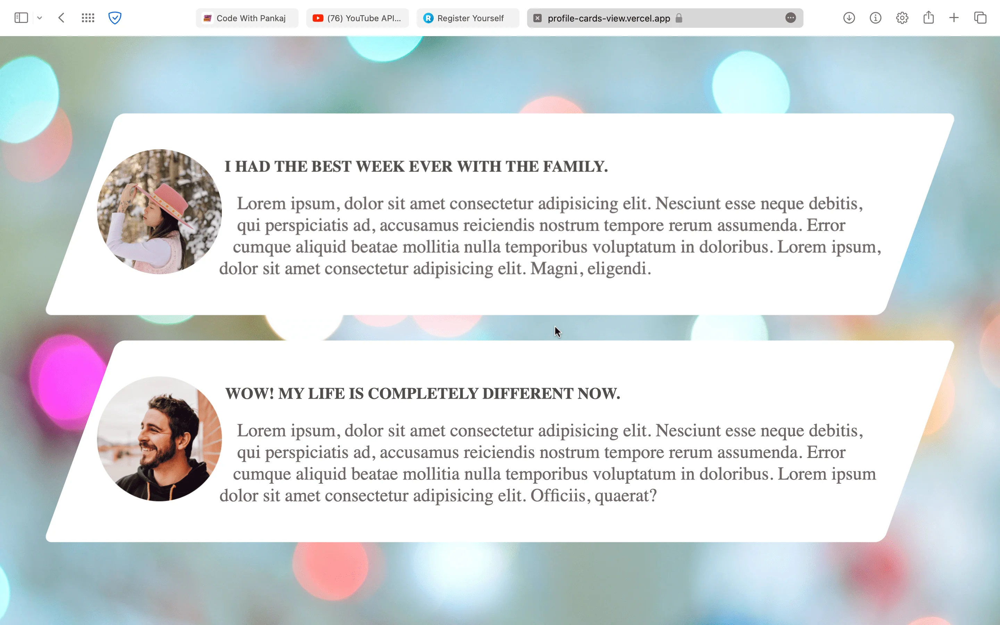

# Profile-Cards-View

Currently, this webpage is about responsive profile cards. These cards react to device screens and perform actions on hover.

## Features

 - Responsive
 - Hover effect
 - Auto fix to device width


## Authors

- [@pankajkumar90](https://www.github.com/pankajkumar90)


## Contributing

Contributions are always welcome!

See `index.html` for ways to get started.

Please adhere to this project's `code of conduct`.


## Demo

https://profile-cards-view.vercel.app
<br><br>
https://pankajkumar90.github.io/Profile-Cards-View/


## Feedback

If you have any feedback, please reach out to us at pankajbaliyan90@gmail.com


## 🔗 Links
[](https://codewithpankaj.vercel.app)

[](https://www.linkedin.com/in/pankaj-kumar-90/)

## Lessons Learned

I learned many things while making this repository, i.e. how to make a webpage responsive to all devices screens and how to add hover effect on a webpage.
## Run Locally

Clone the project

```bash
  git clone https://pankajkumar90.github.io/Profile-Cards-View/
```

Go to the project directory

```bash
  cd my-project
```

Start code editor

```bash
  code .
```


## Screenshots




## Support

For support, email pankajbaliyan90@gmail.com or join our Slack channel.

